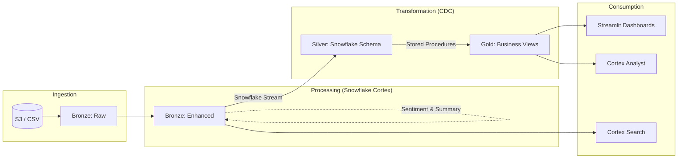
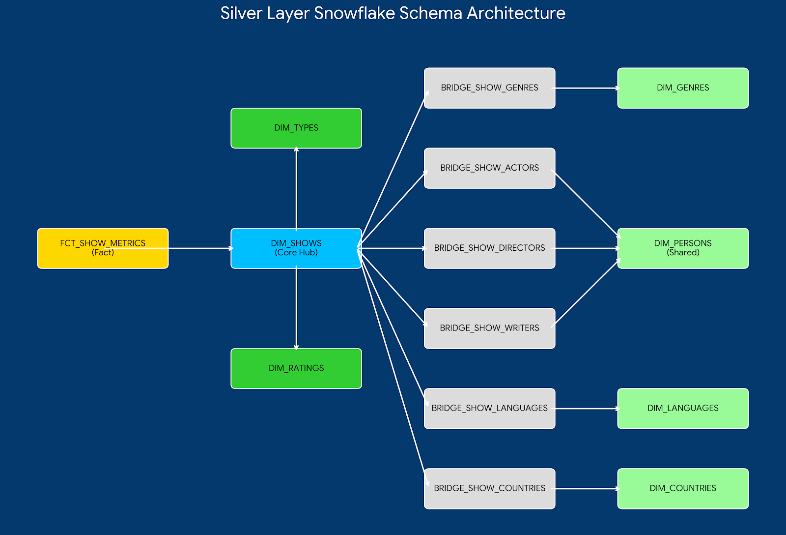

### Disney+ Magic Mirror: AI-Powered Data Engineering Pipeline
#### Overview
Developed as part of the Master’s in Business Analytics (MSBA) program at UT Austin, this project implements an end-to-end data engineering pipeline using a Medallion Architecture in Snowflake. The pipeline transforms raw Disney+ content data into actionable business insights while leveraging Generative AI (Snowflake Cortex) for sentiment analysis, automated summarization, and semantic search.

#### System Architecture 

#### Silver layer architecture : Snowflake schema

#### Key Features
**Medallion Architecture:** Systematic data promotion through Bronze (Raw/Enhanced), Silver (Normalized Star Schema), and Gold (Business Aggregations) layers.

**Incremental ETL via CDC:** Utilized Snowflake Streams and SQL Stored Procedures to implement Change Data Capture (CDC), ensuring efficient, low-latency updates without full table rewrites.

**AI-Enriched Analytics:** Integrated Snowflake Cortex functions (SENTIMENT, SUMMARIZE) to enrich the dataset with emotional tone and concise plot summaries.

**Semantic Search & Analyst:** Implemented Cortex Search for conceptual queries (e.g., "teenage romance") and Cortex Analyst for conversational, non-technical data exploration.

**Interactive BI:** Built three custom Streamlit dashboards to visualize high-impact business use cases.

#### Data Architecture
**1. Bronze Layer (Ingestion & Enrichment)**
Raw Ingestion: Data is ingested from S3-based CSV files into disney_plus_shows_raw.

AI Enrichment: A stored procedure (sp_process_bronze_data) cleans temporal data and applies Cortex AI to generate plot sentiments and summaries.

**2. Silver Layer (Normalization & Star Schema)**
Standardization: Data is moved from Bronze to Silver via sp_process_enhanced_to_silver.

Schema Design: Implemented a robust Star Schema with:

Fact Table: FCT_SHOW_METRICS (IMDb ratings, votes, runtimes).

Dimensions: DIM_SHOWS, DIM_GENRES, DIM_PERSONS, etc.

Bridge Tables: Handles many-to-many relationships for complex attributes like Actors, Directors, and Genres.

**3. Gold Layer (Business Logic)**
Aggregated Views: Final tables optimized for reporting and the Streamlit UI:

GENRE_RELEASE_TIMING_PERFORMANCE: Identifies the best release windows.

AUDIENCE_ENGAGEMENT_DECADE_SENTIMENT: Tracks taste evolution.

POWER_DUOS_PERFORMANCE: Measures creative collaboration impact.

#### Business Use Cases
**Optimal Release Timing:** Analyzes performance patterns to recommend release schedules (e.g., Identifying April and November as peak windows for Action titles).

**Decade-Wise Genre Trends:** Tracks the rise and fall of genre popularity and audience sentiment over time to inform future content gaps.

**Creative Synergy (Power Duos):** Quantifies the rating "uplift" when specific Directors and Writers collaborate, informing high-value talent acquisition.

#### Technology Stack
**Cloud Data Warehouse:** Snowflake

**Languages:** SQL (SnowScript), Python

**AI/ML:** Snowflake Cortex (LLM functions & Search Service)

**Orchestration:** Snowflake Streams & Tasks (CDC), Stored Procedures

**Visualization:** Streamlit
